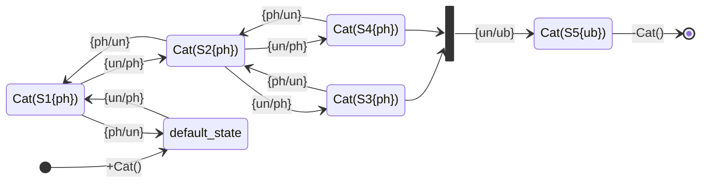
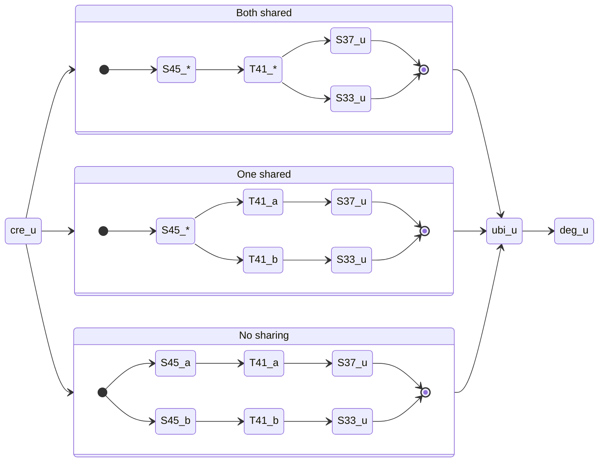

# Wnt Causal Fork

## To run this test

Requires [KaSaAn](https://github.com/hmedina/KaSaAn), written against [v0.5](https://github.com/hmedina/KaSaAn/commit/109037b13cfcf529ae50211986b39c2748a9f12f)

1) Run the test normally, to generate the KaSim & KaTIE outputs
1) Run the validation script to compare one against the other. Exit code 0 means success; otherwise a diff is reported

```
Katie$ python3 runtests.py ./tests/large/wnt-causal-fork run
Katie/tests/large/wnt-causal-fork$ python3 validate_katie.py
```

## Details

### Motivation

This test is inspired by the chain of events by which β-catenin is degraded in canonical Wnt signaling.

A multi-protein complex orchestrates the modification of site S1 (S45 phosphorylation), which allows the modification of site S2 (T41 phosphorylation), which allows the modification of S3 and S4 independently (S37 and S33 phosphorylations), which together allow the modification of a final S5 (ubiquitination of an unknown lysine), which then allows the degradation event. The forward model modifications are performed by several agents (CK1 & GSK, TCP, Prt), some of which are undone by antagonists (CK1 vs. PP1 & GSK vs. PP2).

The story of all agents of type Cat will be described by combinations of these state transitions, from a common introduction, to each agent's degradation:



<details><summary>Gotcha #1: last Y before X</summary>
Any given S4 modification is not guaranteed to be the one that satisfied the S5 modification requirement, as it could have been undone; hence the "last before" constructs in the query, and the usage of snapshot time comparisons. Idem for all the other sites.
</details>

<details><summary>Gotcha #2: S2 != S2</summary>
The "fork" occurs in that the S2 modification that satisfied the modification of S3, is not guaranteed to be the same that satisfied S4 modification. A chain of events could have the series:

1) `[event:a] S2{un/ph}`
1) `[event:b] S3{un/ph}`
1) `[event:c] S2{ph/un}`
1) `[event:d] S2{un/ph}`
1) `[event:e] S4{un/ph}`

Here, S4 modification in event `e` was possible because of event `d`; whereas S3's in `b` because of event `a`.
</details>

The general story graph therefore looks like:

```
                S1{un/ph}   ->  S2{un/ph}   ->  S3{un/ph}
                    /                               \
creation    ->      +                               +       ->  S5{un/ub}   -> degradation
                    \                               /
                S1{un/ph}   ->  S2{un/ph}   ->  S4{un/ph}
```

### What the query does
The trace query operation roots at the degradation event, then proceeds to find the "last Y before X", going back in time, branching at the fork, and finalizing at the creation event, assigning labels. Unambiguous story events have `_u` ; the "lineage" that satisfied S3 is denoted with a `_a`, and S4's is denoted with a `_b`.

This setup allows for three types of stories, classified by the number of pre-conditions that were shared:
1) Both shared: same S2 modification event, by extension, same S1 modification event
1) One shared: different S2 modification events, but same S1 modification event
1) Two shared: different S2 modification events, different S1 modification events




The query produces data that can be processed to identify the frequency of thre three types of stories. Because of the nature of the Gillespie algorithm used by KaSim, where a global state is modified by only one rule application at a time, the time of each event[^1] is sufficient for identification of events.

[^1]: Although time is represented as a floating point value within KaSim, the serialization done for snapshots and the trace render it a string.
